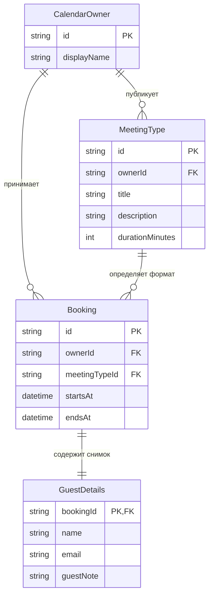

# Доменная модель «Календаря звонков»

Документ фиксирует единый язык и отношения предметной области для сценариев, дизайна, архитектуры и реализации. Технические детали хранения и API находятся в нижних слоях документации.

## Канонический язык

**Владелец календаря**:  
Единственный предустановленный профиль, которому принадлежат типы встреч и бронирования.  
_Не использовать_: администратор, пользователь-владелец.

**Гость**:  
Человек, который бронирует время без аккаунта; его данные сохраняются снимком внутри бронирования.  
_Не использовать_: пользователь, клиент, аккаунт гостя.

**Тип встречи**:  
Публикуемый владельцем формат звонка с идентификатором, названием, описанием и длительностью.  
_Не использовать_: тип события, вид брони.

**Бронирование**:  
Зафиксированный интервал одного типа встречи с данными гостя. В интерфейсе владельца будущее бронирование называется предстоящей встречей.  
_Не использовать_: запись как отдельную сущность, встреча как отдельную сущность.

**Интервал бронирования**:  
Полуоткрытый временной интервал `[начало, окончание)`. Благодаря этому окончание одной встречи может совпадать с началом другой.

**Свободный слот**:  
Вычисляемый допустимый вариант начала для конкретного типа встречи и даты. Слот не является хранимой сущностью.

**Окно записи**:  
Четырнадцать календарных дат по Москве: текущая дата и следующие тринадцать дат.

**Предстоящая встреча**:  
Представление бронирования, время начала которого ещё не наступило. Это не отдельная сущность.

## Связи сущностей

`AvailableSlot`, `BookingWindow` и `UpcomingMeeting` намеренно не показаны как хранимые сущности: они вычисляются из типа встречи, московской даты, рабочего расписания и существующих бронирований.

## Инварианты

- В системе существует ровно один владелец календаря.
- Владелец не регистрируется и не авторизуется.
- Идентификатор типа встречи уникален, имеет длину 3–64 символа и соответствует `[a-z0-9]+(?:-[a-z0-9]+)*`.
- Длительность типа встречи составляет 15–540 минут и кратна 15 минутам.
- Рабочее расписание: понедельник–пятница, `09:00–18:00`, `Europe/Moscow`.
- Начало слота находится на 15-минутной сетке, ещё не наступило и входит в окно записи.
- Весь интервал встречи помещается в рабочее расписание.
- Бронирования любых типов встреч одного владельца не пересекаются.
- Соприкасающиеся интервалы допустимы.
- Из конкурирующих попыток занять один интервал успешна не более одной.
- Имя и email гостя обязательны; заметка необязательна.
