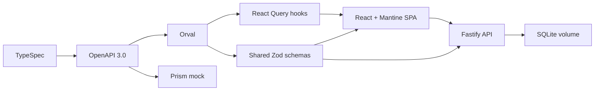

# Software Architecture Document: «Календарь звонков»

**Статус:** технический фундамент  
**Версия:** 0.1  
**Дата:** 2026-08-03

## 1. Назначение

Документ фиксирует технологический фундамент и границы будущего приложения. Продуктовые сущности, endpoint-ы, Gherkin-сценарии и дизайн экранов намеренно не определяются на этом этапе.

## 2. Архитектурный стиль

Система является компактным contract-first TypeScript-монолитом с раздельными frontend и backend пакетами. В development они запускаются отдельно, в production Fastify раздаёт собранную React SPA и API из одного контейнера и origin.

## 3. Технологический стек

| Область                    | Решение                                                      |
| -------------------------- | ------------------------------------------------------------ |
| Runtime                    | Node.js 24 LTS, pnpm 11, TypeScript 6.0.3, ESM               |
| Frontend                   | React 19.2+, Vite 8, Mantine 9, React Router, TanStack Query |
| Формы и runtime validation | `@mantine/form`, Zod-схемы из Orval                          |
| Дата и время               | `date-fns`, `@date-fns/tz`, зона `Europe/Moscow`             |
| Backend                    | Fastify 5, `fastify-type-provider-zod`                       |
| Persistence                | Drizzle ORM 0.45.2 stable, `better-sqlite3`, SQL-миграции    |
| API contract               | TypeSpec → OpenAPI 3.0 → Orval                               |
| Тесты                      | Vitest, Storybook Vitest addon, Playwright, `playwright-bdd` |
| Качество                   | Oxlint, Oxfmt, `tsc --noEmit`                                |
| Доставка                   | multi-stage `node:24-bookworm-slim`, SQLite Docker volume    |

## 4. Слои документации и кода

- Слой 2 содержит `UIElements.ts`, Gherkin-сценарии и Storybook-дизайн. Storybook заменяет Figma.
- Слой 3 содержит этот SAD, TypeSpec и сгенерированный OpenAPI.
- Слой 4 содержит frontend, backend, e2e и общий generated API package.
- Контракт каждого собственного production TypeScript-модуля хранится рядом с реализацией как `*.contract.d.ts`.
- Generated-код, tests, stories и configs не требуют соседних контрактов.
- Реализация может импортировать CSS Modules и дизайн-токены слоя 2 через `@design`, но не импортирует оттуда JSX или продуктовую логику.

## 5. Contract-first поток

1. TypeSpec является редактируемым источником API.
2. TypeSpec компилируется в OpenAPI 3.0.
3. Orval генерирует native-fetch React Query hooks только для frontend.
4. Отдельный Orval output генерирует общие Zod-схемы для frontend и backend.
5. OpenAPI и generated TypeScript хранятся в Git.
6. CI повторяет codegen и отклоняет рассинхронизированный diff.
7. Prism предоставляет mock API для независимой frontend-разработки.

Моменты времени передаются как RFC 3339 UTC (`utcDateTime`), календарные даты — как `plainDate` (`YYYY-MM-DD`). SQLite хранит моменты как UTC epoch milliseconds. Отображение и календарные вычисления выполняются в `Europe/Moscow`.

## 6. Runtime и данные

- Development frontend обращается к относительному `/api`, который Vite проксирует в Fastify или Prism.
- Production frontend и API используют один origin; CORS не требуется.
- Fastify перед началом прослушивания применяет коммитнутые Drizzle-миграции.
- SQLite использует foreign keys, WAL и busy timeout.
- Будущая операция бронирования должна выполнять проверку пересечений и вставку внутри immediate transaction.
- SQLite-файл хранится вне контейнера в постоянном volume.

## 7. Проверки

Обязательный CI pipeline: проверка codegen-diff, форматирование, lint, typecheck, unit/API tests, Storybook tests, Chromium e2e, production build и Docker build. Существующий `hexlet-check.yml` не изменяется.

На этапе технического фундамента допускаются только инфраструктурные smoke-проверки. Продуктовые тесты добавляются вместе со спецификацией и фичами.

## 8. Ограничения текущего этапа

- Продуктовые endpoint-ы и модели не определены.
- UI-дизайн и Gherkin-сценарии не создаются.
- Календарные правила и бронирование не реализуются.
- Допускается инфраструктурный health endpoint для проверки сквозного contract/codegen/runtime потока.
