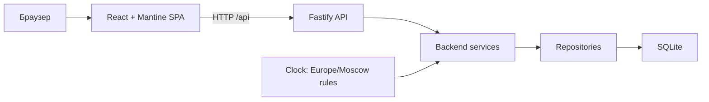
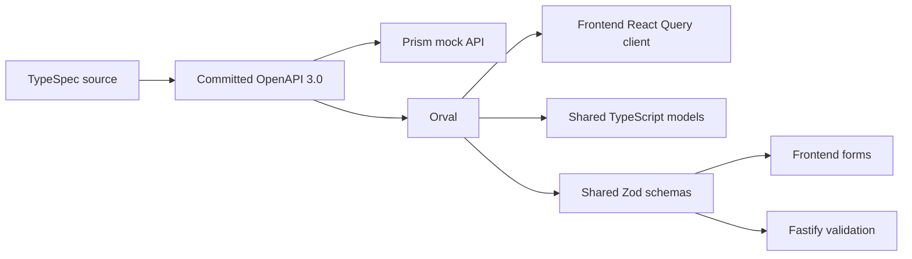
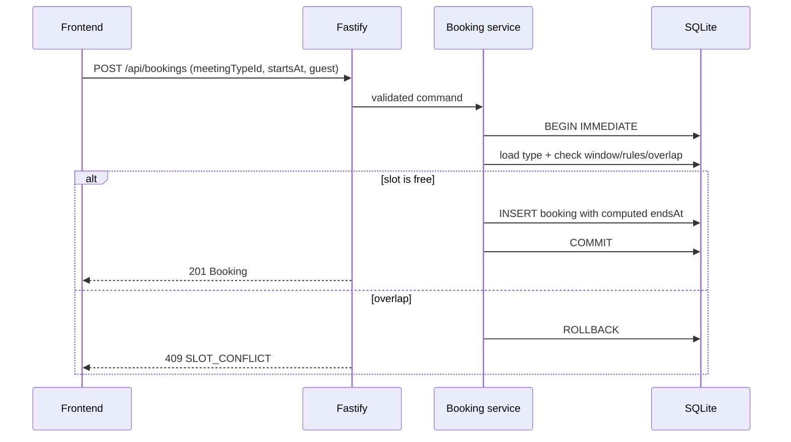

# Software Architecture Document: «Календарь звонков»

**Статус:** утверждённая архитектура MVP
**Версия:** 1.0
**Дата:** 2026-08-23

## 1. Назначение и источники требований

Документ фиксирует границы системы, API, владение состоянием и потоки данных для реализации продукта из `1. Vision and Product/PRD.md`. Детальное поведение и UX определены в слое `2. Spec, UX and Test Cases`; учебные требования design-first — в `0. Context/Lesson2.txt`.

TypeSpec-файл `api/main.tsp` является единственным редактируемым источником API-контракта. `api/generated/openapi.yaml` и весь generated TypeScript являются производными артефактами.

## 2. Архитектурный стиль и границы

Система является компактным contract-first TypeScript-монолитом с отдельными frontend и backend пакетами. В development они запускаются раздельно, в production Fastify раздаёт React SPA и API с одного origin.

Граница ответственности:

- frontend хранит только состояние представления: текущий маршрут, выбранный тип, дату, слот и несохранённые значения формы;
- backend владеет каноническими типами встреч и бронированиями;
- backend вычисляет окно записи, доступные даты, слоты, окончание встречи, пересечения и сортировку;
- frontend не воспроизводит календарные правила и не считает server state;
- SQLite является единственным постоянным хранилищем runtime-состояния;
- внешние сервисы, авторизация, аналитика и очереди в MVP отсутствуют.

## 3. Технологический стек

| Область                    | Решение                                                       |
| -------------------------- | ------------------------------------------------------------- |
| Runtime                    | Node.js 24 LTS, pnpm 11, TypeScript 6, ESM                    |
| Frontend                   | React 19, Vite 8, Mantine 9, React Router, TanStack Query     |
| Формы и runtime validation | `@mantine/form`, generated Zod-схемы                          |
| Дата и время               | `date-fns`, `@date-fns/tz`, `Europe/Moscow`                   |
| Backend                    | Fastify 5, `fastify-type-provider-zod`                        |
| Persistence                | Drizzle ORM, `better-sqlite3`, SQL-миграции                   |
| API contract               | TypeSpec 1.14 → OpenAPI 3.0 → Orval 8                         |
| Тесты                      | Vitest, Fastify `inject`, Storybook Vitest, Playwright BDD    |
| Качество                   | Oxlint, Oxfmt, `tsc --noEmit`                                 |
| Доставка                   | multi-stage `node:24-bookworm-slim`, постоянный SQLite volume |

## 4. Contract-first поток

Правила codegen:

1. Редактируется только `api/main.tsp`.
2. TypeSpec генерирует коммитящийся `api/generated/openapi.yaml` версии `1.0.0`.
3. Orval генерирует native-fetch React Query functions/hooks во frontend.
4. Orval генерирует общие TypeScript-модели и Zod-схемы в package `@calendar/api-contract`.
5. Handwritten frontend transport преобразует non-2xx ответы в типизированный `ApiError`.
6. Fastify routes, services и repositories пишутся вручную и используют generated schemas; генерация бизнес-логики и server stubs не выполняется.
7. CI повторяет `pnpm codegen` и требует пустой `git diff` после генерации.

## 5. HTTP API

API не имеет авторизации: административная часть публична как осознанное ограничение учебного MVP. Версия контракта — `1.0.0`; version prefix в URL отсутствует.

| Operation ID                 | Метод и путь                                          | Назначение                                 |
| ---------------------------- | ----------------------------------------------------- | ------------------------------------------ |
| `getHealth`                  | `GET /api/health`                                     | Readiness HTTP-процесса и SQLite           |
| `listMeetingTypes`           | `GET /api/meeting-types`                              | Типы встреч в порядке создания             |
| `getMeetingType`             | `GET /api/meeting-types/{meetingTypeId}`              | Загрузка прямой страницы типа встречи      |
| `createMeetingType`          | `POST /api/meeting-types`                             | Создание типа встречи                      |
| `getMeetingTypeAvailability` | `GET /api/meeting-types/{meetingTypeId}/availability` | Готовый 14-дневный снимок доступности      |
| `createBooking`              | `POST /api/bookings`                                  | Атомарная проверка и создание бронирования |
| `listUpcomingBookings`       | `GET /api/bookings/upcoming`                          | Будущие бронирования по возрастанию начала |

Списки возвращаются прямыми JSON-массивами. Пагинация и фильтры отсутствуют.

## 6. Контракт данных

Основные модели TypeSpec:

- `OwnerSummary`: `id`, `displayName` единственного владельца;
- `MeetingType`: идентификатор, владелец, название, описание, длительность;
- `MeetingTypeSummary`: компактное вложение в availability и booking;
- `GuestDetails`: обязательные имя и email, необязательная заметка;
- `Booking`: идентификатор, владелец, тип встречи, начало, вычисленное окончание и снимок данных гостя;
- `AvailabilityResponse`: тип встречи, момент генерации, границы окна, timezone и 14 элементов `DateAvailability`;
- `DateAvailability`: московская дата, `bookable`, optional reason и отсортированные слоты;
- `AvailabilitySlot`: UTC-начало, UTC-окончание и `available | occupied`;
- `ApiError`: стабильный code, русское сообщение и optional массив ошибок полей.

Временные правила:

- моменты API — `UtcInstant`: RFC 3339 `date-time` с обязательным UTC-суффиксом `Z`;
- календарные даты — `YYYY-MM-DD` (`plainDate`);
- продуктовые расчёты — `Europe/Moscow`;
- окно содержит текущую московскую дату и следующие 13 дат;
- рабочее время — понедельник–пятница, `09:00–18:00`;
- начало находится на 15-минутной сетке;
- прошедшие слоты текущей даты не возвращаются;
- занятые слоты не раскрывают ID бронирования или данные гостя;
- если свободных слотов нет, дата имеет reason `NO_SLOTS`, но будущие занятые слоты остаются в снимке.

Backend нормализует входные строки: выполняет trim, приводит email к lowercase и удаляет пустую после trim заметку.

## 7. Ошибки

Все non-2xx ответы используют `ApiError`. Frontend ветвится по `code`, а не по тексту.

| HTTP | Code                          | Условие                                                    |
| ---- | ----------------------------- | ---------------------------------------------------------- |
| 400  | `VALIDATION_ERROR`            | Поля, сетка, выходной, рабочие границы или полный интервал |
| 400  | `DATE_OUTSIDE_BOOKING_WINDOW` | Начало вне текущего 14-дневного окна                       |
| 404  | `MEETING_TYPE_NOT_FOUND`      | Тип встречи отсутствует                                    |
| 409  | `DUPLICATE_MEETING_TYPE`      | ID типа встречи уже существует                             |
| 409  | `SLOT_CONFLICT`               | Интервал пересекает сохранённое бронирование               |
| 500  | `INTERNAL_ERROR`              | Непредвиденная серверная ошибка                            |

`fieldErrors` является массивом `{ field, message }`. Сообщения предназначены для русского UI; машинная логика использует только `code` и `field`.

После `SLOT_CONFLICT` frontend заново запрашивает availability. Ошибка не содержит дублирующий календарный снимок.

## 8. Ключевые потоки данных

### 8.1. Загрузка каталога и прямой ссылки

1. SPA запрашивает список или конкретный тип встречи generated query function.
2. Fastify валидирует запрос generated Zod-схемой.
3. Repository читает типы владельца из SQLite в порядке создания.
4. Backend возвращает `OwnerSummary` внутри каждого типа.

### 8.2. Получение доступности

1. SPA передаёт только `meetingTypeId`.
2. Backend получает текущее время через внедряемый clock.
3. Backend строит 14 московских дат и применяет рабочее расписание.
4. Backend создаёт подходящие длительности слоты с шагом 15 минут.
5. Backend сопоставляет их со всеми бронированиями владельца независимо от типа.
6. SPA получает готовый отсортированный snapshot и только отображает его.

### 8.3. Создание бронирования

Клиент не отправляет `endsAt`. Повторный POST не использует `Idempotency-Key`: после первой успешной вставки он получает обычный `SLOT_CONFLICT`.

### 8.4. Предстоящие встречи

Backend выбирает записи со `startsAt > clock.now()`, сортирует их по `startsAt` и возвращает готовый список. Начавшееся ровно сейчас бронирование уже не считается предстоящим.

## 9. Persistence и конкурентность

- SQLite хранит моменты как UTC epoch milliseconds.
- При подключении включаются foreign keys, WAL и busy timeout.
- Миграции применяются до запуска HTTP-сервера.
- Проверка пересечений и `INSERT` выполняются в одной immediate transaction.
- Интервалы полуоткрытые: `[startsAt, endsAt)`; соприкосновение допустимо.
- Из двух конкурентных запросов на один интервал успешно завершается ровно один.
- Профиль владельца, типы встреч и бронирования сохраняются после рестарта.

## 10. Тестируемость и трассировка

- API-сценарии слоя 3 находятся в `api/features` и имеют идентификаторы `@API-*`.
- Сценарии не используют `UIElements.ts`, поскольку проверяют HTTP-контракт, а не UI.
- Integration tests используют Fastify `inject`, изолированную SQLite database и управляемый test clock.
- Публичные тестовые headers и endpoint-ы для управления временем запрещены.
- Обязательные случаи: валидация, 14 дней, Москва, рабочие границы, 15-минутная сетка, пересечение, соприкосновение, конфликт, конкурентные запросы и сортировка.
- Playwright BDD слоя 4 исполняет исходные `.feature` слоя 2 напрямую, без копий, и связывает каждый `@SCN-*` с `UIElements.ts`, реальным frontend, HTTP backend и тестовой SQLite.
- Все продуктовые сценарии помечены `@e2e`; 23 уникальных идентификатора разворачиваются в 29 browser-тестов с учётом `Структура сценария`.

## 11. Структура слоёв

- Слой 2: Gherkin продукта, `UIElements.ts`, доменная модель и Storybook-дизайн.
- Слой 3: SAD, TypeSpec, API Gherkin и generated OpenAPI.
- Слой 4: frontend, backend, e2e и shared generated API package.
- Каждый handwritten production module в слое 4 имеет соседний `*.contract.ts`: runtime-экспорты подключаются через `import`, типы — через `import type`.
- Контракт перечисляет обязательные зависимости, описывает роль, состояние и существенную логику модуля и может содержать небольшие переиспользуемые runtime-функции.
- Generated-файлы, tests, stories и configs освобождены от соседних контрактов.
- Реализация может импортировать CSS Modules и tokens слоя 2 через `@design`, но не импортирует Storybook JSX или его flow logic.
